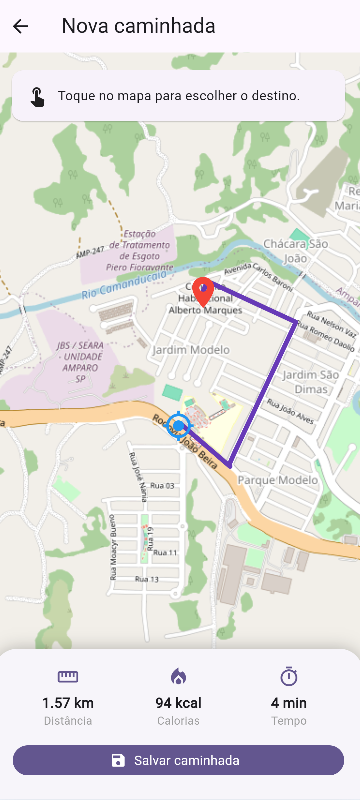
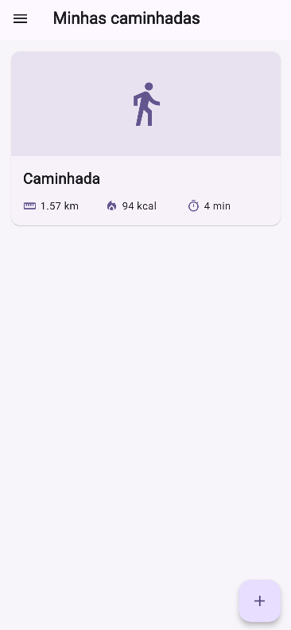
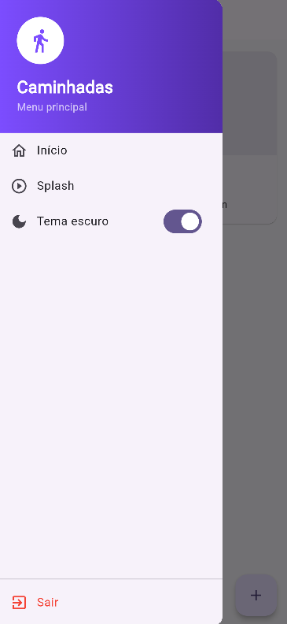

# 🚶 App Caminhadas

Aplicação desenvolvida em **Flutter** para registrar caminhadas, visualizar trajetos em um mapa interativo e salvar as informações dos percursos realizados.

O projeto utiliza o **OpenStreetMap** para exibição do mapa e o **OSRM** para traçar rotas entre pontos, permitindo ao usuário planejar e acompanhar seus trajetos.

---

## 📱 Funcionalidades

* 🗺️ Exibição de um mapa interativo
* 📍 Captura da localização atual do usuário
* 🛣️ Traçado de rotas utilizando o OSRM
* 🚶 Cadastro de novas caminhadas
* 💾 Salvamento das caminhadas
* 📋 Visualização das caminhadas salvas
* 🌙 Alternância entre tema claro e escuro
* 📂 Menu lateral de navegação
* 🔄 Tela de abertura (Splash Screen)
* 🖼️ Seleção de imagens
* ⚙️ Armazenamento de preferências do aplicativo

---

## 🛠️ Tecnologias utilizadas

* **Flutter**
* **Dart**
* **flutter_map**
* **latlong2**
* **geolocator**
* **image_picker**
* **shared_preferences**
* **http**
* **OpenStreetMap**
* **OSRM**

---

## 📦 Dependências

Para instalar as dependências utilizadas no projeto, execute os seguintes comandos no terminal:

```bash
flutter pub add flutter_map

flutter pub add latlong2

flutter pub add geolocator

flutter pub add image_picker

flutter pub add shared_preferences

flutter pub add http
```

Depois, execute:

```bash
flutter pub get
```

Por fim, para iniciar o aplicativo:

```bash
flutter run
```

---

## 🗺️ Mapas e rotas

O aplicativo utiliza o **flutter_map** em conjunto com o **OpenStreetMap** para exibir o mapa.

Para o cálculo e traçado das rotas, é utilizado o serviço **OSRM (Open Source Routing Machine)**.

---

## 📍 Localização

O pacote **geolocator** é utilizado para obter a localização atual do usuário e possibilitar a utilização dos recursos de localização durante as caminhadas.

---

## 💾 Armazenamento

O aplicativo utiliza recursos de armazenamento local para manter as informações e preferências do usuário disponíveis mesmo após o fechamento da aplicação.

---

## 🖼️ Imagens

O pacote **image_picker** permite selecionar imagens no dispositivo para utilização dentro do aplicativo.

---

## ⚙️ Preferências

O pacote **shared_preferences** é utilizado para armazenar configurações e preferências do aplicativo localmente.

---

## 🌐 Requisições HTTP

O pacote **http** é utilizado para realizar requisições necessárias para o consumo dos serviços utilizados pelo aplicativo, como o serviço de rotas.

---

## 📱 Gerar APK

O arquivo **.apk** serve para testar o aplicativo em dispositivos **Android**.

### 🔨 Gerando o APK

Ao concluir uma parte do seu aplicativo, execute o seguinte comando no terminal do VS Code:

```bash
flutter build apk --release
```

## 🖥️ Prints das telas

### Tela Inicial


### Tela Home


### Tela do Mapa



### Tela Home com Caminhada Salva



### Menu Lateral



---

## 👩‍💻 Lívia Mazzolini Guarizo
